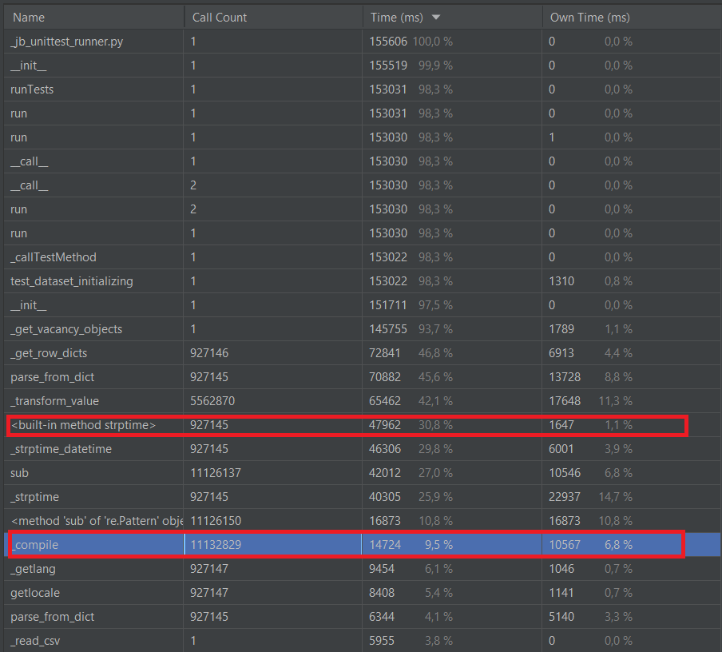
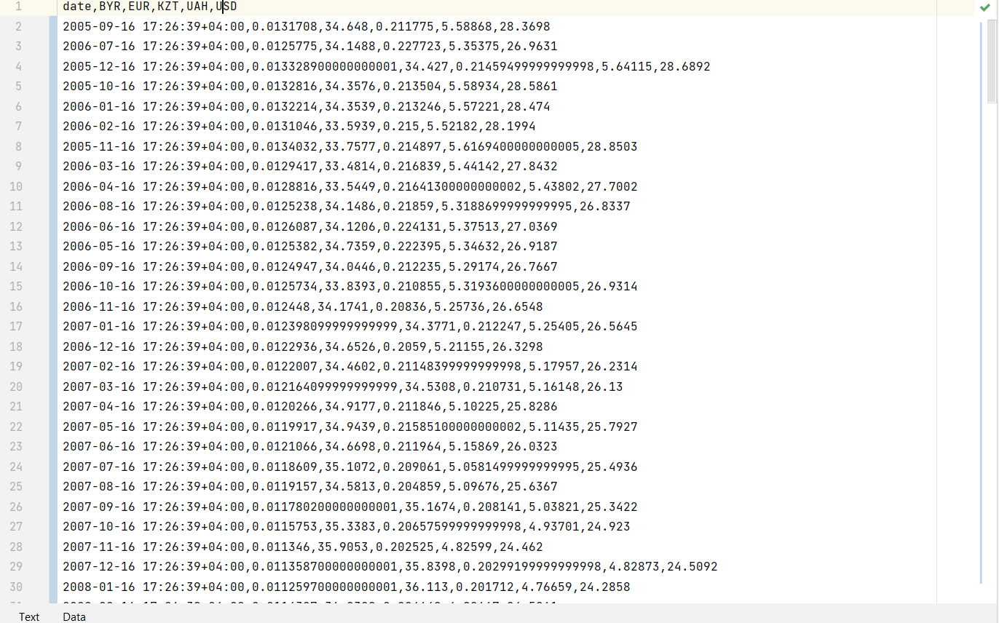

# UrFU HeadHunter Parser

Repository has been created to solve tasks for Ural Federal University

Made by Kazantsev Sergey

## Test results

All the tests passed

## How the program was sped up by 40%

The screenshot below shows that **datetime.strptime** and **re.compile** were one of the heaviest parts of the program. These methods
spent about **40%** of all executing time.

To optimize the program I have:
1. Created compiled patterns to clean tags and spaces in cells. Now re.compile is called only 2 times instead of 2*N.
2. Changed function to parse datetime

#### Three alternatives for standard strptime
To optimize datetime parsing, I've created 3 another methods:
1. Using [ciso8601](https://github.com/closeio/ciso8601) library.
2. Using regex.
3. Using my own algorithm.

And then the functions were tested in these 3 cases:
1. Single string for 1 million times.
2. String values of every second in 9 days.
3. Loop of 9 strings and 1 wrong string for 100`000 times (1 million values in total)

Result of the tests:

Parser with ciso8601 is the fastest here. I've swapped standard parsing for the function. 

Finally, the program works for 62 seconds instead of 155 (It's **40%** of the time)

## Year Separation

## Multiprocessing Test

## Currency Dataframes

